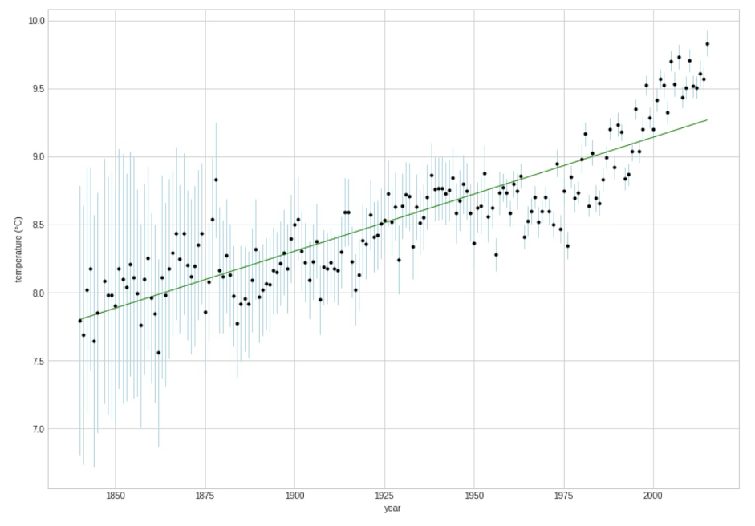

# Weather Prediction and Climate Change Analysis
This project is divided into two parts, Part 1 involves building a machine learning model using the GHCN dataset, which contains historical weather records like daily temperatures, precipitation, and more. The goal here is short-term weather prediction.
Part 2 focuses on analyzing long-term climate trends using Earth Surface Temperature data, aiming to understand how global temperatures have shifted over time. In both cases, the datasets were cleaned, filtered, and processed before being used to train models.

# Why Ridge Regression?
We chose Ridge Regression, a linear model with L2 regularization, because of the nature of the data. Weather-related datasets often have highly correlated features — for example, humidity and temperature, or max/min daily temps. This multicollinearity can make simple linear regression unstable or biased in its predictions.
Ridge Regression handles this better by penalizing large coefficients, reducing overfitting and helping the model generalize well on unseen data. It works well when there are many input features, and you want to avoid the model being too sensitive to noise or outliers — which is often the case with real-world environmental data.

In Part 1, Ridge Regression helped model short-term weather patterns with decent predictive accuracy. In Part 2, it supported the analysis of long-term climate variation by highlighting gradual shifts in global temperature data.

# Evaluation
The model's performance was measured using Mean Absolute Error (MAE) — the average difference between predicted and actual values.

Initial MAE: 5.14

Final MAE: 4.7

The improvement was achieved by adjusting predictors in the weather dataset and tuning model parameters.

## Ridge Regression Plot for Climate Change Analysis

Climate Change is analysed by calculating average land temperature for each year and plotting the values from mid-19th to 20th century. The graph provides evidence for global warming, as indicated by an upward trend in temperature, especially in recent decades.

